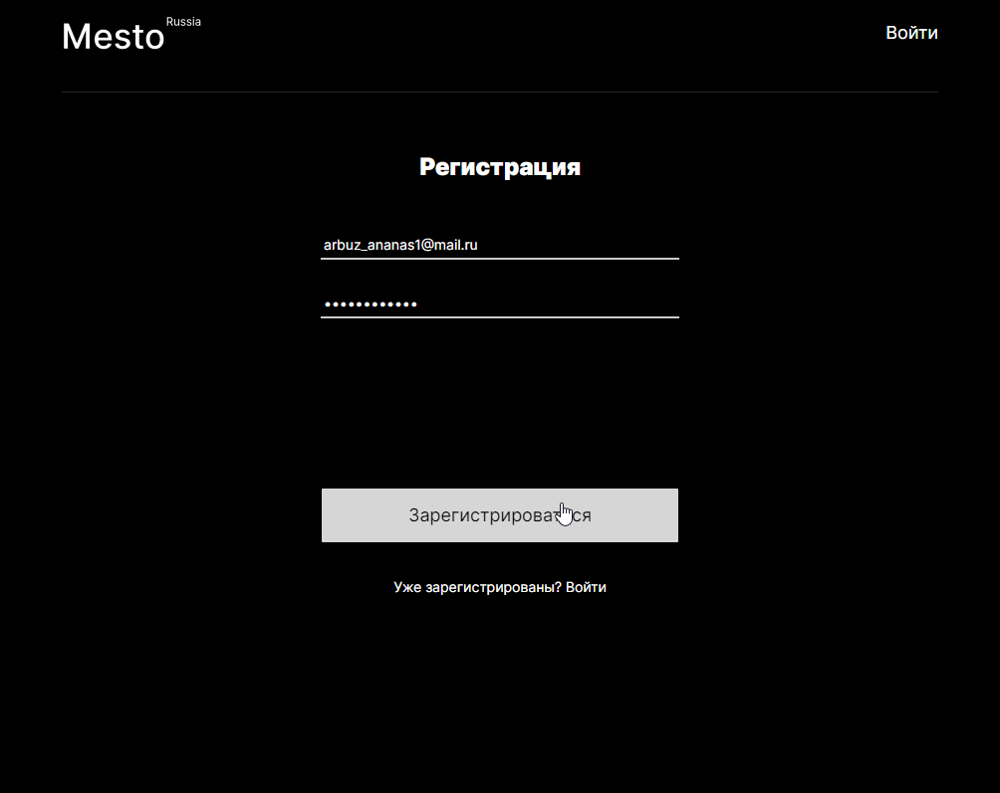

# [Mesto React](https://arseny-arsenyevich.github.io/react-mesto-auth/)




## **Описание проекта**
Сервис для просмотра и публикации фотографий, с возможностью ставить лайки, редактировать профиль. Данные берутся и отправляются на сервер, есть валидация форм, роутинг. Вёрстка по макету Figma. Проект проходил код-ревью.
Посмотреть можно [здесь](https://arseny-arsenyevich.github.io/react-mesto-auth/)

## **Стек**
+ HTML/CSS
+ JavaScript
+ React

## **Технологии**
+ React хуки
+ React Router
+ LocalStorage
+ Взаимодействие с Api
+ Create React App
+ BEM
+ Адаптивная вёрстка
+ Валидация форм на реакте
+ Логика авторизации отделена от фреймворка
+ Исправлена проблема взаимодействия GitHub Pages и React Router

## **Установка**
__Клонировать репозиторий__
```
git clone https://github.com/arseny-arsenyevich/react-mesto-auth
```

__Режим разработки__
```
npm run start
```

__Билд__
```
npm run build
```

## **Что доделать?**
+ Улучшить UI (добавить красивых анимаций для кнопок, надписей; добавить причину ошибки при сабмите)
+ Оптимизировать загрузку изображений (Lazy Loading, постепенная загрузка)
+ Добавить линтер
+ Написать тесты
+ Разгрузить компонент App
+ Объединить Login и Register в один компонент
+ Добавить авторизацию с помощью Google, VK etc.
+ Выдавать 404 при неправильном адресе
+ Добавить отдельный роут для каждой картинки

## **Ссылки**
+ [Mesto на VanillaJS](https://github.com/arseny-arsenyevich/mesto)
+ [Mesto на React без авторизации](https://github.com/arseny-arsenyevich/mesto-react)